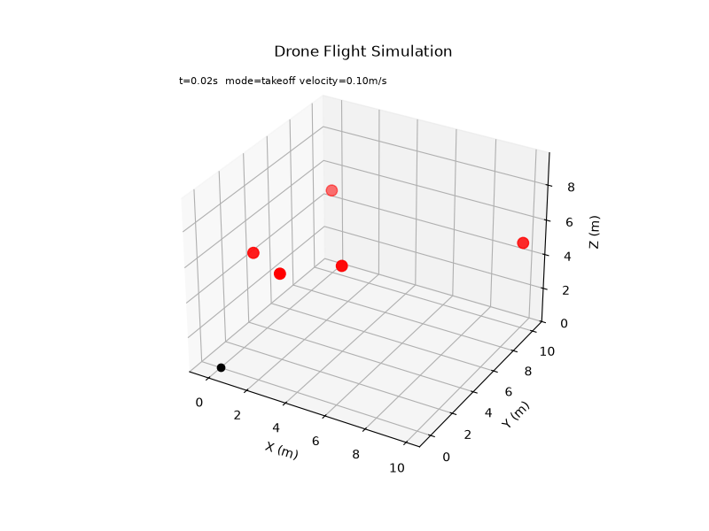

# Drone Physics Sandbox

A Python simulation of a drone navigating 3D space using Newtonian physics, a PD controller, and flight mode scheduling.



## What it does

Simulates a complete drone flight:
- **Takeoff** → climbs vertically under thrust
- **Hover** → holds position using a PD controller
- **Navigate** → flies through a sequence of 3D waypoints, also PD-controlled
- **Landing** → descends and touches down
- **Idle** → motors off

## Physics

- Euler integration (`position += velocity × dt`)
- Gravity, thrust, and velocity-proportional drag (`F_drag = -k × v × |v|`)
- PD controller for waypoint tracking and hover position hold:
  ```
  thrust = (waypoint - position) × KP  −  velocity × KD
  ```

## Project Structure

```
src/
  vectors.py            # Vector3 with full arithmetic
  constants.py          # Physics constants and tuning parameters
  drone.py              # DroneState dataclass + Drone integrator
  physics.py            # PhysicsEngine (gravity, drag, net force)
  flight_controller.py  # Flight modes + PD hover controller
  waypoint_navigator.py # PD waypoint navigation
  simulation.py         # Time loop, history logging, CSV export
  visualizer.py         # Static plot + animation + GIF export

tests/
  test_vectors.py
  test_drone.py
  test_physics.py
  test_simulation.py
  test_flight_controller.py
  test_waypoint_navigator.py
```

## Run

```bash
python main.py
```

## Test

```bash
pytest -v
```

## Dependencies

- Python 3.10+
- matplotlib
- Pillow

## Trail colors

| Color | Mode |
|-------|------|
| 🟢 Green | Takeoff |
| 🟡 Yellow | Hover |
| 🔵 Blue | Navigate |
| 🟠 Orange | Landing |
| ⚫ Gray | Idle |
